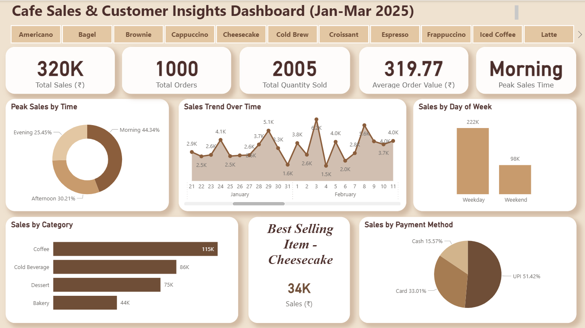

# Cafe Sales Dashboard (Power BI)

## 📊 Overview
This project presents an interactive cafe sales dashboard built in Power BI to analyze sales performance, customer behavior, and product trends using a dataset of 1000 transactions.

## 🎯 Objective
To transform raw sales data into actionable insights and understand revenue patterns, customer preferences, and product performance.

## 🚀 Key Insights
- Total Sales: ₹320K  
- Total Orders: 1000  
- Total Quantity Sold: 2005  
- Average Order Value: ₹319.77  
- Peak Sales Time: Morning  
- Best Selling Item: Cheesecake (₹34K)

## 📈 Features
- KPI Cards (Sales, Orders, Quantity, AOV)  
- Time-based sales analysis  
- Sales trend over time  
- Category-wise performance  
- Payment mode analysis  
- Weekday vs Weekend comparison  
- Interactive product filters  

## 🛠 Tools & Skills Used
- Power BI  
- Data Modeling  
- DAX  
- Data Visualization  

## 📷 Dashboard Preview

## 📥 Download File
[Download PBIX File](Cafe_Dashboard.pbix)

## 💡 Conclusion
This dashboard helps analyze customer purchasing behavior, identify peak sales periods, and track top-performing products for better business decisions.
